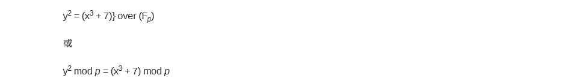
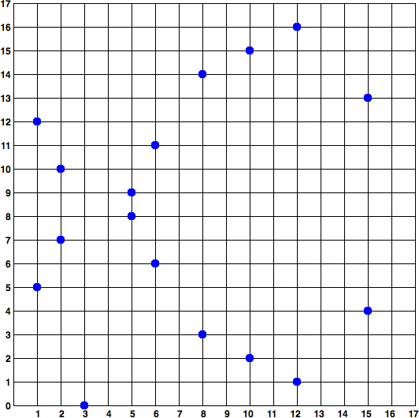
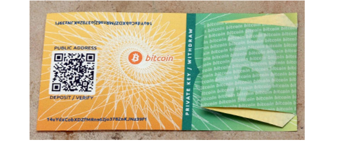
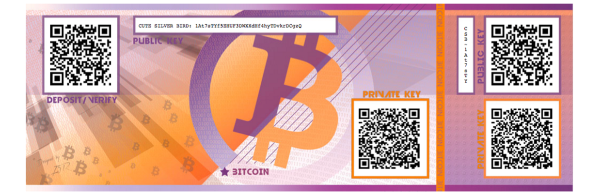

# 第 4 章 密钥和地址

你可能听说过比特币基于*加密技术*的，加密技术是由数学分支出来的，在计算机安全领域被广泛使用。 密码术在希腊语中是“秘密写作”的意思，但密码学这门学科不仅仅只有秘密写作，还包括加密技术。 密码学可以用于不泄露秘密（数字签名），就能证明知晓加密的内容，或证明数据的真实性（数字指纹）。 这些类型的加密证明是比特币中至关重要的数学工具，并被广泛用于比特币应用。有趣的是，加密不是比特币的重要组成部分，因为它的通信和交易数据没有加密，也不需要加密来保护资金。 在本章中，我们将介绍一些在比特币中用来控制资金所有权的加密技术，包括密钥，地址和钱包。

## 4.1 简介

比特币的所有权是通过*数字密钥、比特币地址和数字签名*来确定的。数字密钥实际上并不存储在网络中，而是由用户生成之后，存储在一个叫做*钱包*的文件或简单的数据库中。用户钱包中的数字密钥完全独立于比特币协议，可由用户的钱包软件生成并管理，而无需参照区块链或访问互联网。密钥实现了比特币的许多有趣特性，包括去中心化信任和控制、所有权认证和基于密码学证明的安全模型。

大多数比特币交易都需要在区块链中存储一个有效的数字签名。该数字签名只能由密钥产生，因此拥有密钥副本就等于拥有了该帐户中比特币的控制权。用于支出资金的数字签名也称为*见证（witness）*，这是加密技术中的术语。 比特币交易中的见证数据证明了资金的真正所有权。

密钥是成对出现的，由私钥和公钥所组成。公钥就像银行的帐号，而私钥就像 PIN 码或支票的签名。比特币的用户很少会直接看到数字密钥。一般情况下，它们存储在钱包文件内，由比特币钱包软件进行管理。

在比特币交易的支付环节，收款人的公钥由数字指纹表示，称为*比特币地址*，就像支票上收款人名称 （即“付给谁的账户”）。一般情况下，比特币地址由公钥生成并与之对应。然而，并非所有比特币地址都代表公钥； 也可以代表其他支付对象，譬如脚本，我们将在本章后面提及。这样一来，比特币地址就可以抽象成资金接收者，使得交易更灵活，就像纸质支票：可以支付到个人账户、公司账户，支付账单和现金。比特币地址是密钥被用户能够看到的唯一形式，因为这个地址就是需要告诉别人的。

首先，我们将介绍密码学，并解释在比特币中使用的数学知识。然后我们将了解密钥的产生、存储和管理方式。我们将检查私钥和公钥、地址和脚本地址的各种编码格式。最后，我们将讲解密钥和地址的高级用途：比特币靓号地址，多重签名以及脚本地址和纸钱包。

### 4.1.1 公钥加密和加密货币

公钥加密发明于 20 世纪 70 年代，它是计算机和信息安全的数学基础。

公钥加密被发明之后，一些合适的数学函数被发现，譬如：素数幂运算和椭圆曲线乘法。这些数学函数都是不可逆的， 就是说很容易向一个方向计算，但不可以向相反方向倒推。基于这些数学函数的密码学，使得生成数字密钥和不可伪造的数字签名成为可能。比特币正是使用椭圆曲线乘法作为其公钥加密的基础。

在比特币系统中，我们用公钥加密创建一个密钥对，用于控制对比特币的访问。密钥对包括一个私钥，和由其衍生出的唯一的公钥。公钥用于接收比特币，而私钥用于支付时进行交易签名。

公钥和私钥之间的数学关系，使得私钥可用于生成特定消息的签名。公钥则可以在不显示私钥的情况下验证签名。

支付比特币时，比特币的当前所有者需要在交易中提交其公钥和签名（每次交易的签名都不同，但都由同一个私钥生成）。针对展示的公钥和签名，比特币网络中的所有人都可以验证该交易有效并予以接受，从而确认支付者对该交易中的比特币的所有权。

> **提示** 大多数比特币钱包工为了方便会将私钥和公钥以*密钥对*的形式存储在一起。然而，公钥可以由私钥计算得到， 所以只存储私钥也是可以的。

### 4.1.2 私钥和公钥

一个比特币钱包中包含一系列的密钥对，每个密钥对包括一个私钥和一个公钥。私钥（_k_）是一个数字，通常是随机选出的。基于私钥，我们就可以使用椭圆曲线乘法这个单向加密函数产生一个公钥（_K_）。基于公钥（_K_），我们就可以使用一个单向加密哈希函数生成比特币地址（_A_）。在本节中，我们将从生成私钥开始，讲述如何使用椭圆曲线运算将私钥生成公钥，并最终由公钥生成比特币地址。私钥、公钥和比特币地址之间的关系如下图所示。


图 4-1:私钥、公钥和比特币地址之间的关系

**为什么使用非对称加密（公钥/私钥）？**

为什么在比特币中使用非对称加密技术？ 它不是用于对交易进行“加密”（保密）的。 相反，非对称加密技术的最有用特性是生成数字签名。 可以将私钥用作交易的数字指纹来产生数字签名。 该签名只能由知晓私钥的人生成。 但是，任何访问公钥和交易指纹的人都可以验证签名。 这种非对称密码学的适用性使得任何人都可以验证每笔交易的每个签名，并且确保只有私钥的所有者可以生成有效的签名。

### 4.1.3 私钥

私钥就是一个随机选出的数字而已。拥有和控制了私钥，就相当于控制了该私钥对应的比特币地址中的所有资金。通过证明比特币交易中资金的所有权，私钥可以生成花费该笔资金的签名。私钥任何情况下都必须保密，因为一旦被泄露给第三方，相当于该私钥保护之下的比特币也拱手相让了。私钥还必须进行备份，以防意外丢失，因为私钥一旦丢失就无法恢复，其所保护的比特币也将永远丢失。

> **提示** 比特币私钥只是一个数字。你可以用硬币、铅笔和纸来随机生成你的私钥：掷硬币 256 次，用纸和笔记录正反面并转换为 0 和 1，随机得到的 256 位二进制数字可作为比特币钱包的私钥。该私钥可进一步生成公钥。

**_从一个随机数生成私钥_**
生成密钥的第一步也是最重要的一步，是要找到足够安全的熵源，即随机性来源。生成一个比特币私钥在本质上与“在 1 到 2<sup>256</sup>之间选一个数字”无异。只要选取的结果是不可预测或不可重复的，那么选取数字的具体方法并不重要。比特币软件使用操作系统底层的随机数生成器来产生 256 位的熵（随机性）。通常情况下，操作系统随机数生成器由人工的随机源进行初始化，这就是为什么也可能需要不停晃动鼠标几秒钟。

更准确地说，私钥可以是 1 和 n-1 之间的任何数字，其中 n 是一个常数（n=1.158 \* 10<sup>77</sup>，略小于 2<sup>256</sup>），并被定义为由比特币所使用的椭圆曲线的阶（见下面的椭圆曲线密码学解释这一节）。要生成这样的一个私钥，我们随机选择一个 256 位的数字，并检查它是否小于 n-1。从编程的角度来看，一般是通过在一个密码学安全的随机源中取出一长串随机字节，对其使用 SHA256 哈希算法进行运算，这样就可以方便地产生一个 256 位的数字。如果运算结果小于 n，我们就有了一个合适的私钥。否则，我们就用另一个随机数再重复一次。

> **警告** 不要自己写代码来生成随机数，也不要使用编程语言提供的简易随机数生成器来获得一个随机数。使用密码学安全的伪随机数生成器（CSPRNG），并且需要有一个熵源值足够的的种子。使用随机数发生器的程序库时，需仔细研读其文档，以确保它是密码学安全的。正确实施 CSPRNG 是密钥安全性的关键所在。

以下是一个随机生成的私钥（k），以十六进制格式表示（256 位的二进制数，转变为十六进制是 64 位，每个十六进制数占 4 位）：

1E99423A4ED27608A15A2616A2B0E9E52CED330AC530EDCC32C8FFC6A526AEDD

> **提示** 比特币私钥空间的大小是 2<sup>256</sup>，这是一个非常大的数字。用十进制表示的话，大约是 10<sup>77</sup>，而可见宇宙被估计只含有 10<sup>80</sup>个原子。

要使用 Bitcoin Core 客户端生成一个新的密钥（参见第三章内容），可使用 getnewaddress 命令。出于安全考虑，命令运行后只显示生成的公钥，而不显示私钥。如果要 bitcoind 显示私钥，可以使用 dumpprivkey 命令。 dumpprivkey 命令会把私钥以 Base58 校验和编码格式显示，这种私钥格式被称为钱包导入格式（WIF，Wallet Import Format），在“私钥的格式”一节有详细讲解。下面给出了使用这两个命令生成和显示私钥的例子：

```
$ bitcoin-cli getnewaddress
1J7mdg5rbQyUHENYdx39WVWK7fsLpEoXZy
$ bitcoin-cli dumpprivkey 1J7mdg5rbQyUHENYdx39WVWK7fsLpEoXZy
KxFC1jmwwCoACiCAWZ3eXa96mBM6tb3TYzGmf6YwgdGWZgawvrtJ
```

dumpprivkey 命令打开钱包提取由 getnewaddress 命令生成的私钥。除非密钥对都存储在钱包里，否则 bitcoind 并不能从公钥得知私钥。

> **提示** dumpprivkey 命令无法从公钥生成私钥，因为这是不可能的。这个命令只是显示钱包中已有也就是由 getnewaddress 命令生成的私钥。

还可以使用 Bitcoin Explorer 命令行工具（请参阅附录中的[appdx_bx]）使用命令 seed，ec-new 和 ec-to-wif 生成和显示私钥：

```
$ bx seed | bx ec-new | bx ec-to-wif
5J3mBbAH58CpQ3Y5RNJpUKPE62SQ5tfcvU2JpbnkeyhfsYB1Jcn
```

### 4.1.4 公钥

通过椭圆曲线乘法可以从私钥计算得到公钥，这是不可逆转的过程：_K = k _ G* 。其中 *k* 是私钥，*G* 是被称为*生成点*的常数点，而 *K* 是所得公钥。其反向运算，被称为“寻找离散对数”——已知公钥 K 来求出私钥*k*——是非常困难的，就像去尝试所有可能的*k\*值，即暴力搜索。在演示如何从私钥生成公钥之前，我们先稍微详细学习下椭圆曲线加密算法。

> **提示** 椭圆曲线乘法是密码学家称之为“陷阱门”的一种函数：在一个方向（乘法）很容易计算，而在相反的方向（除法）是不可能计算出来的。 私钥的所有者可以容易地创建公钥，然后与世界共享，知道没有人可以从公钥反转该函数计算出私钥。 这个数学技巧成为证明比特币资金所有权不可伪造和安全的数字签名的基础。

### 4.1.5 椭圆曲线加密（Elliptic Curve Cryptography）解释

椭圆曲线加密算法是一种基于离散对数问题的非对称或者公钥加密算法，可以用对椭圆曲线上的点进行加法或乘法运算来表达。

下图是一个椭圆曲线的示例，类似于比特币所用的曲线。


图 4-2 椭圆曲线的示例

比特币使用了 secp256k1 标准所定义的一种特殊的椭圆曲线和一系列数学常数。该标准由美国国家标准与技术研究院 （NIST）建立。secp256k1 曲线由下述函数定义，该函数可产生一条椭圆曲线：



上述 mod p（素数 p 取模）表明该曲线是在素数阶 p 的有限域内，也写作 Fp，其中 p = 2<sup>256</sup> – 2<sup>32</sup> – 2<sup>9</sup> – 2<sup>8</sup> – 2<sup>7</sup> – 2<sup>6</sup> – 2<sup>4</sup> – 1， 这是个非常大的素数。

因为这条曲线被定义在一个素数阶的有限域内，而不是定义在实数范围，它的函数图像看起来像二维的离散的点，因此很难可视化。不过，该公式与实数的椭圆曲线数学公式是相似的。为了举例，下图显示了在一个小了很多的素数阶 17 的有限域内的椭圆曲线，其形式为网格上的一系列散点。而 secp256k1 的比特币椭圆曲线可以被想象成一个更大的网格上一系列更为复杂的散点。



图 4-3：椭圆曲线密码学 F(p)上的椭圆曲线，其中 p = 17

比如，下面是 secp256k1 曲线上的点 P，其坐标为(x，y)。

```
`P = (55066263022277343669578718895168534326250603453777594175500187360389116729240, 32670510020758816978083085130507043184471273380659243275938904335757337482424)`
```

下面的例 1 显示了如何使用 Python 对其检验：

例 1：使用 pyhton 确认这个点在椭圆曲线上

```
Python 3.4.0 (default, Mar 30 2014, 19:23:13)
[GCC 4.2.1 Compatible Apple LLVM 5.1 (clang-503.0.38)] on darwin
Type "help", "copyright", "credits" or "license" for more information.
>>> p = 115792089237316195423570985008687907853269984665640564039457584007908834671663
>>> x = 55066263022277343669578718895168534326250603453777594175500187360389116729240
>>> y = 32670510020758816978083085130507043184471273380659243275938904335757337482424
>>> (x ** 3 + 7 - y**2) % p
0
```

在椭圆曲线数学中，有一个点被称为“无穷远点”，这大致相当于 0 的作用。计算机中，它有时表示为 X = Y = 0（虽然这不满足椭圆曲线方程，但这是一个可以单独检查的例子）。

还有一个 + 运算符，被称为“加法”，就像小学数学中的实数相加。给定椭圆曲线上的两个点 P<sub>1</sub>和 P<sub>2</sub>，则椭圆曲线上必定有第三点 P<sub>3</sub> = P<sub>1</sub> + P<sub>2</sub>。

从几何学上说，该第三点 P<sub>3</sub>可以在 P<sub>1</sub>和 P<sub>2</sub>之间画一条线来计算出来的。这条直线恰好与椭圆曲线相交于另外一个地方。此点记为 P<sub>3</sub>'= (x，y)。然后，基于 x 轴的对称点就是 P<sub>3</sub>=(x，-y)。

下面是几个解释为何需要“无穷远点”的特殊例子。

若 P<sub>1</sub>和 P<sub>2</sub>是同一点，那么 P<sub>1</sub>和 P<sub>2</sub>之间的连线延长就会与曲线相切于 p<sub>1</sub>处。该切线将会与曲线相交于一个新的点。该切线的斜率可用微积分求得。尽管我们只局限在曲线上两个整数坐标的那个点，但这个机制是没问题的。

在某些情况下（即，如果 P<sub>1</sub>和 P<sub>2</sub>具有相同的 x 值，不同的 y 值），则切线会完全垂直，在这种情况下，P<sub>3</sub> = “无穷远点”。

若 P<sub>1</sub>就是“无穷远点”，那么其和 P<sub>1</sub> + P<sub>2</sub>= P<sub>2</sub>。类似地，当 P<sub>2</sub>是无穷远点，则 P<sub>1</sub>+ P<sub>2</sub> = P<sub>1</sub>。这表明无穷远点类似于 0 的角色。

事实证明，在这里 + 运算符遵守结合律，即(A+B)+C = A+(B+C)。这就是说我们可以书写成 A + B + C，不加括号也可以，而不至于混淆。

至此，我们已经定义了椭圆加法，我们可以用标准方法对加法进行扩展，来定义乘法。给定椭圆曲线上的点 P，如果 k 是整数，则 kP = P + P + P + …+ P（k 次）。注意，在这种情况下 k 有时被混淆了称为“指数”。

### 4.1.6 生成公钥

以一个随机生成的私钥*k*为起点，将其乘以曲线上一个预定的点，叫做*生成点 G*得到曲线上的另一点，这就是相应的公钥 _K_。生成点是 secp256k1 标准的一部分，比特币密钥的生成点都是相同的：

{K = k \* G}

其中*k*是私钥，*G*是生成点，在该曲线上所得的点*K*是公钥。因为所有比特币用户的生成点是相同的，一个私钥*k*乘以*G*将得到相同的公钥*K*。*k*和*K*之间的关系是固定的，但只能单向运算，即从*k*得到*K*。这就是可以把比特币地址（*K*的衍生） 与任何人共享而不会泄露私钥（_k_）的原因。

> **提示** 因为其中的数学运算是单向的，所以私钥可以转换为公钥，但公钥不能转换回私钥。

实现了椭圆曲线乘法，我们用之前产生的私钥*k*和与生成点*G*相乘得到公钥*K*：

```
K = 1E99423A4ED27608A15A2616A2B0E9E52CED330AC530EDCC32C8FFC6A526AEDD * G
```

公钥*K* 被定义为一个点 _K_ = (x, y)：

```
 K = (x, y)

其中，

x = F028892BAD7ED57D2FB57BF33081D5CFCF6F9ED3D3D7F159C2E2FFF579DC341A
y = 07CF33DA18BD734C600B96A72BBC4749D5141C90EC8AC328AE52DDFE2E505BDB
```

为了可视化展示整数与点的乘积，我们使用实数范围的简化的椭圆曲线。请记住，其中的数学原理是相同的。我们的目标是找到生成点*G*的倍数*kG*。也就是将*G*相加*k*次。在椭圆曲线中，点的相加等于该点的切线与曲线相交的那个点，该点基于 x 轴的对称点。

下图显示了在曲线上得到 _G、2G、4G_ 的几何做法。


图 4-4 曲线上 G、2G、4G 的几何做法

> **提示**大多数比特币程序使用[【OpenSSL 加密库】](http://bit.ly/1ql7bn8)进行椭圆曲线计算。例如，调用 EC_POINT_mul() 函数，可计算得到公钥。

## 4.2 比特币地址

比特币地址是一个由数字和字母组成的字符串，可以展示给任何给你转账比特币的人。由公钥（一个同样由数字和字母组成的字符串）生成的比特币地址以数字“1”开头。下面是一个比特币地址的例子：

1J7mdg5rbQyUHENYdx39WVWK7fsLpEoXZy

在交易中，比特币地址通常作为资金接受者地址。如果把比特币交易比作一张支票，比特币地址就是收益人，也就是写入“支付给谁”一栏的内容。一张支票的收款人可能是某个银行账户，也可能是某个公司、机构，甚至是现金支票。由于支票不需要指定一个特定的账户，而是用一个抽象的名字作为收款人，这就使它成为一种相当灵活的支付工具。与此类似，比特币交易使用类似的抽象：比特币地址，这就使比特币交易变得很灵活。比特币地址代表一对公钥和私钥的所有者，也可以代表其它东西，比如会在后面的“P2SH (Pay-to-Script-Hash)”一节讲到的付款脚本。现在，让我们来看一个简单的例子，比特币地址代表公钥，并由公钥生成。

比特币地址可由公钥经过单向加密哈希算法得到。哈希算法是一种单向函数，接收任意长度的输入产生指纹或哈希。加密哈希函数在比特币中被广泛使用 ：比特币地址、脚本地址以及在挖矿中的工作量证明算法。由公钥生成比特币地址时使用的算法是 Secure Hash Algorithm (SHA)和 the RACE Integ rity Primitives Evaluation Message Digest (RIPEMD)，具体来说是 SHA256 和 RIPEMD160。

以公钥 _K_ 为输入，计算其 SHA256 哈希值，并以此结果计算 RIPEMD160 哈希值，得到一个长度为 160 位（20 字节）的数字：

A = RIPEMD160(SHA256(K))

公式中，*K*是公钥，*A*是生成的比特币地址。

> **提示** 比特币地址与公钥并不不同。比特币地址是公钥经过单向的哈希函数生成的。

通常用户见到的比特币地址是经过“Base58Check”编码的（参见下面的“Base58 和 Base58Check 编码”一节），这种编码使用了 58 个字符（Base58 数字系统）和校验码，提高了可读性、避免歧义并有效防止了在地址转录和输入中产生的错误。Base58Check 编码也被用于比特币的其它地方，例如比特币地址、私钥、加密的密钥和脚本哈希中，用来提高可读性和录入的正确性。下一节中我们会详细解释 Base58Check 的编码和解码机制，以及它产生的结果。

下图描述了如何从公钥生成比特币地址。


图 4-5 从公钥生成比特币地址]

### 4.2.1 Base58 和 Base58Check 编码

为了更简洁方便地表示长串的数字，使用更少的符号，许多计算机系统在表示大于十进制时，会使用数字和字母混合组成。例如，传统的十进制计数系统使用 0-9 十个数字，而十六进制系统使用了 16 个，增加了 A-F 六个字母来表示 0-9 额外的符号。一个同样的数字，它的十六进制表示就会比等值得十进制表示更短。更为简洁的是，Base64 使用了 26 个小写字母、26 个大写字母、10 个数字以及两个符号（例 如“+”和“/”），用于在像电子邮件这样的文本媒介中传输二进制数据。Base64 通常用于邮件中添加二进制附件。Base58 是一种基于文本的二进制编码格式，用在比特币和其它的加密货币中。这种编码格式提供了紧凑表示，易读性，错误检测预防这几方面彼此之间的平衡。Base58 是 Base64 编码格式的子集，同样使用大小写字母和 10 个数字，但舍弃了一些容易读错和在特定字体中外观容易混淆的字符。具体地，Base58 不含 Base64 中的 0（数字 0）、O（大写字母 o）、l（小写字母 L）、I（大写字母 i），以及“+”和“/”两个字符。简而言之，Base58 就是由不包括（0，O，l，I）的大小写字母和数字组成。下面的例 4-2 是完整的 Base58 字母表。

例 4-2 比特币的 Base58 字母表

123456789ABCDEFGHJKLMNPQRSTUVWXYZabcdefghijkmnopqrstuvwxyz

为了增加防止打印和转录错误的安全性，比特币常用的是 Base58Check，它是一种内置错误校验代码的 Base58 编码格式。检验和是额外 4 个字节，被添加到正在编码的数据末端。校验和是从编码的数据的哈希值中得到的，所以可以用来检测并避免转录和输入中产生的错误。使用 Base58check 编码时，解码软件会计算数据的校验和并和编码中自带的校验和进行对比。二者不匹配则表明有错误产生，这个 Base58Check 的数据就是无效的。这就防止输错的比特币地址被钱包软件认为是有效的地址，造成资金的丢失。

为了将数据（数字）转换成 Base58Check 格式，首先我们要对数据添加一个称作“版本字节”的前缀，这个前缀用来识别编码的数据的类型。例如，比特币地址的前缀是 0（十六进制是 0x00），而编码私钥的前缀是 128（十六进制是 0x80）。 表 4-1 会列出一些常见版本的前缀。

接下来，我们计算“双哈希”校验和，意味着要对之前的结果（前缀和数据）运行两次 SHA256 哈希算法：

```
checksum = SHA256(SHA256(prefix+data))
```

在产生的长度为 32 个字节的哈希值（两次哈希运算）中，我们只取前 4 个字节。这 4 个字节就作为检验错误的代码或者校验和。将校验码添加到最后。

结果由三部分组成：前缀、数据和校验和。这个结果采用之前描述的 Base58 字母表编码。下图描述了 Base58Check 编码的过程。


图 4-6 Base58Check 编码：Base58、版本化和校验和格式，用于对比特币数据进行明确编码

在比特币中，大多数需要向用户展示的数据都使用 Base58Check 编码，因为它紧凑，易读而且有错误检验。 Base58Check 编码中的版本前缀是用来创造易于辨别的格式 Base58 编码时，该格式在 base58check 编码的负载的开头包含特定字符。这些字符使人们很容易了解别被编码的数据的类型和使用方法。例如我们很容易看到，Base58Check 编码的比特币地址是以 1 开头的，而 Base58Check 编码的私钥 WIF 是以 5 开头的。表 4-1 展示了一些版本前缀和他们对应的 Base58 格式。

表 4-1 Base58Check 版本前缀和编码后的结果

| Type                         | Version prefix (hex) | Base58 result prefix |
| ---------------------------- | -------------------- | -------------------- |
| Bitcoin Address              | 0x00                 | 1                    |
| Pay-to-Script-Hash Address   | 0x05                 | 3                    |
| Bitcoin Testnet Address      | 0x6F                 | m or n               |
| Private Key WIF              | 0x80                 | 5, K, or L           |
| BIP-38 Encrypted Private Key | 0x0142               | 6P                   |
| BIP-32 Extended Public Key   | 0x0488B21E           | xpub                 |

### 4.2.2 密钥的格式

公钥和私钥都可以有多种格式。虽然看起来可能不同，但是所编码的是同样的数字。这些不同的编码格式主要是用来方便人们无误地阅读和抄写。

#### 4.2.2.1 私钥的格式

私钥的格式有许多，所有这些都对应于相同的 256 位的数字。表 4-2 展示了私钥的三种常见格式。不同的格式用在不同的场景。十六进制和原始的二进制格式用在软件的内部，很少展示给用户看。WIF 格式用在钱包之间密钥的输入和输出，也用于代表私钥的二维码（条形码）。

表 4-2 私钥形式（编码格式）

| Type           | Prefix | Description                                                                  |
| -------------- | ------ | ---------------------------------------------------------------------------- |
| Raw            | None   | 32 bytes                                                                     |
| Hex            | None   | 64 hexadecimal digits                                                        |
| WIF            | 5      | Base58Check encoding: Base58 with version prefix of 128- and 32-bit checksum |
| WIF-compressed | K or L | As above, with added suffix 0x01 before encoding                             |

下表表 4-3 显示了三种格式的私钥。

表 4-3 示例：相同的私钥，不同的格式

| Format         | Private key                                                      |
| -------------- | ---------------------------------------------------------------- |
| Hex            | 1e99423a4ed27608a15a2616a2b0e9e52ced330ac530edcc32c8ffc6a526aedd |
| WIF            | 5J3mBbAH58CpQ3Y5RNJpUKPE62SQ5tfcvU2JpbnkeyhfsYB1Jcn              |
| WIF-compressed | KxFC1jmwwCoACiCAWZ3eXa96mBM6tb3TYzGmf6YwgdGWZgawvrtJ             |

这些格式都表示相同的数字，相同的私钥。虽然编码后的字符串看起来不同，但任何一种格式都能很容易转换为其他格式。请注意，“raw binary”未显示在表 4-3 示例中，因为根据定义，此处显示的任何编码的格式，都不是 raw binary 数据。

我们使用 Bitcoin Explorer 中的 wif-to-ec 命令（请参阅[appdx_bx]）来显示两个 WIF 键代表相同的私钥：

```
$ bx wif-to-ec 5J3mBbAH58CpQ3Y5RNJpUKPE62SQ5tfcvU2JpbnkeyhfsYB1Jcn

1e99423a4ed27608a15a2616a2b0e9e52ced330ac530edcc32c8ffc6a526aedd

$ bx wif-to-ec KxFC1jmwwCoACiCAWZ3eXa96mBM6tb3TYzGmf6YwgdGWZgawvrtJ

1e99423a4ed27608a15a2616a2b0e9e52ced330ac530edcc32c8ffc6a526aedd
```

#### 4.2.2.2 从 Base58Check 解码

Bitcoin Explorer 命令（参见本书附录[appdx_bx]）使我们很容易编写 shell 脚本和命令行“管道”，处理比特币密钥，地址和交易。 Bitcoin Explorer 命令行可以解码 Base58Check 格式。

我们使用 base58check-decode 命令解码未压缩的密钥：

```
$ bx base58check-decode 5J3mBbAH58CpQ3Y5RNJpUKPE62SQ5tfcvU2JpbnkeyhfsYB1Jcn
wrapper
{
checksum 4286807748
payload 1e99423a4ed27608a15a2616a2b0e9e52ced330ac530edcc32c8ffc6a526aedd
version 128
}
```

结果包含密钥有效内容（payload），WIF 版本前缀 128 和校验和。

请注意，压缩密钥的“有效内容”附加了后缀 01，表示派生的公钥要被压缩：

```
$ bx base58check-decode KxFC1jmwwCoACiCAWZ3eXa96mBM6tb3TYzGmf6YwgdGWZgawvrtJ
wrapper
{
checksum 2339607926
payload 1e99423a4ed27608a15a2616a2b0e9e52ced330ac530edcc32c8ffc6a526aedd01
version 128
}
```

#### 4.2.2.3 将十六进制转换为 Base58Check 编码

要转换成 Base58Check（与上一个命令相反），使用 Bitcoin Explorer 的 base58check-encode 命令（请参阅本书附录[appdx_bx]），需要十六进制私钥，后面跟 WIF 版本前缀 128：

```
bx base58check-encode 1e99423a4ed27608a15a2616a2b0e9e52ced330ac530edcc32c8ffc6a526aedd --version 128
5J3mBbAH58CpQ3Y5RNJpUKPE62SQ5tfcvU2JpbnkeyhfsYB1Jcn
```

#### 4.2.2.4 将十六进制（压缩格式密钥）转换为 Base58Check 编码

要将压缩格式的私钥（参见“压缩格式私钥”一节）编码为 Base58Check，需要在十六进制私钥的后面添加后缀 01，然后使用跟上面一样的方法：

```
$ bx base58check-encode 1e99423a4ed27608a15a2616a2b0e9e52ced330ac530edcc32c8ffc6a526aedd01 --version 128
KxFC1jmwwCoACiCAWZ3eXa96mBM6tb3TYzGmf6YwgdGWZgawvrtJ
```

生成的 WIF 压缩格式的私钥以字母“K”开头，表明被编码的私钥中有一个后缀“01”，且该私钥只能被用于生成压缩格式的公钥（参见“压缩格式公钥”一节）。

#### 4.2.2.5 公钥的格式

公钥也可以用多种不同格式来表示，通常分为非压缩格式或压缩格式公钥这两种形式。

我们从前文可知，公钥是在椭圆曲线上的一个点，由一对坐标（x，y）组成。公钥通常表示为前缀 04 紧接着两个 256 位的数字。其中一个 256 位数字是公钥的 x 坐标，另一个 256 位数字是 y 坐标。前缀 04 是是非压缩格式公钥， 压缩格式公钥是以 02 或者 03 开头。

下面是由前文中的私钥所生成的公钥，其坐标 x 和 y 如下：

```
x = F028892BAD7ED57D2FB57BF33081D5CFCF6F9ED3D3D7F159C2E2FFF579DC341A
y = 07CF33DA18BD734C600B96A72BBC4749D5141C90EC8AC328AE52DDFE2E505BDB
```

下面是同样的公钥以 520 位的数字（130 个十六进制数字）来表达。这个 520 位的数字以前缀 04 开头，紧接着是 x 坐标及 y 坐标，格式为：04 x y：

```
K = 04F028892BAD7ED57D2FB57BF33081D5CFCF6F9ED3D3D7F159C2E2FFF579DC341A07CF33DA18BD734C600B96A72BBC4749D5141C90EC8AC328AE 52DDFE2E505BDB
```

#### 4.2.2.6 压缩格式公钥

比特币引入压缩格式公钥是为了减少交易的大小，从而节省运行区块链数据库的节点磁盘空间。大部分比特币交易包含了公钥，用于验证用户的凭证和支付比特币。每个公钥有 520 位（包括前缀，x 坐标，y 坐标）。如果每个区块有数百个交易，每天有成千上万的交易发生，区块链里就会被写入大量的数据。

正如“4.1.4 公钥”一节所述，一个公钥是一个椭圆曲线上的点(x, y)。而椭圆曲线实际是一个数学方程，曲线上的点实际是该方程的一个解。因此，如果我们知道了公钥的 x 坐标，就可以通过解方程 y<sup>2</sup> mod p = (x<sup>3</sup> + 7) mod p 得到 y 坐标。这可以让我们只存储公钥的 x 坐标，略去 y 坐标，从而将公钥的大小和存储空间减少了 256 位。这样每笔交易需要的字节数减少了近一半，随着时间推移，就能保存更多的交易数据。

未压缩格式公钥使用 04 作为前缀，而压缩格式公钥是以 02 或 03 作为前缀。为什么会有两个前缀：因为椭圆曲线加密的公式的左边是 y<sup>2</sup> ，也就是说 y 的解是来自于一个平方根，可能是正值也可能是负值。更形象地说，y 坐标可能在 x 坐标轴的上面或者下面。就像图 4-2 的椭圆曲线图中可以看出，曲线是对称的，就像是 x 轴的镜像。因此，如果我们略去 y 坐标，就必须储存 y 的符号（正号或者负号）。换句话说，需要知道在 x 轴的上方还是下方，因为上方下方代表椭圆曲线上不同的点，即不同的公钥。当我们在素数 p 阶的有限域上使用二进制算术计算椭圆曲线的时候，y 坐标可能是偶数或者奇数，分别对应前面所讲的 y 值的正/负符号。因此，为了区分 y 坐标的两种可能值，在生成压缩格式公钥时，如果 y 是偶数，则使用 02 作为前缀；如果 y 是奇数，则使用 03 作为前缀。这样就可以让软件能够根据 x 坐标，正确推导出对应的 y 坐标，从而将公钥解压缩为在椭圆曲线上点的完整坐标。下图阐释了公钥压缩：


图 4-7 公钥压缩

下面是前述章节所生成的公钥，使用了 264 比特（66 个十六进制数字）的压缩格式公钥格式，其中前缀 03 表示 y 坐标是一个奇数：

```
K = 03F028892BAD7ED57D2FB57BF33081D5CFCF6F9ED3D3D7F159C2E2FFF579DC341A
```

这个压缩格式公钥对应着同样的一个私钥，意味它是由同样的私钥所生成。但是压缩格式公钥和非压缩格式公钥看起来不同。更重要的是，如果我们使用双哈希函数(RIPEMD160(SHA256(K)))将压缩格式公钥转化成比特币地址，得到的地址将会不同于由非压缩格式公钥产生的地址。这种结果会让人迷惑，一个私钥生成了两种不同格式的公钥——压缩格式和非压缩格式，这两种格式的公钥又生成了两个不同的比特币地址。但是，这两个不同的比特币地址的私钥是一样的。

压缩格式公钥渐渐成为了各种比特币客户端的默认格式，它可以大大减少交易所需的字节数，同时也让存储区块链所需的磁盘空间变小。然而，并非所有的客户端都支持压缩格式公钥，于是那些较新的支持压缩格式公钥的客户端就不得不考虑如何处理那些来自较老的不支持压缩格式公钥的客户端的交易。当一个钱包应用导入另一个钱包应用的私钥的时候就会变得尤其重要，因为新钱包需要扫描区块链并找到所有与这些被导入密钥相关的交易。比特币钱包应该扫描哪个比特币地址呢？到底是压缩的公钥产生的比特币地址，还是通过非压缩的公钥产生的地址？两个都是有效的比特币地址，都可以被私钥签名，但是他们是不同的比特币地址。

为了解决这个问题，当私钥从钱包中被导出时，WIF 表示私钥时，在较新的比特币钱包里被处理的方式就会有所不同，表明该私钥已经被用来生成压缩的公钥和*压缩*的比特币地址。这让导入钱包可以区分私钥来自于老钱包还是新钱包，使用分别对应于压缩格式公钥还是非压缩格式公钥的比特币地址，搜索区块链中对应的交易。我们将在下一节详细解释这种机制是如何工作的。

#### 4.2.2.7 压缩格式私钥

实际上“压缩格式私钥”是一种名称上的误导，因为当私钥使用 WIF 压缩格式导出时，不但没有压缩，反而比“非压缩格式”私钥长出一个字节。这个多出来的一个字节是私钥被加了后缀 01，用以表明该私钥是来自于一个较新的钱包，只能被用来生成压缩公钥。私钥并没有压缩的，也不能被压缩。“压缩私钥”实际上表示“只能生成压缩公钥的私钥”，而“非压缩私钥”用来表明“只能生成非压缩公钥的私钥”。为避免更多误解，应该只可以说导出格式 是“WIF 压缩格式”或者“WIF”，而不能说这个私钥是“压缩”的。

表 4-4 展示了同样的私钥的 WIF 和 WIF 压缩格式编码。
表 4 示例：相同的密钥，不同的格式

| Format         | Private key                                                        |
| -------------- | ------------------------------------------------------------------ |
| Hex            | 1E99423A4ED27608A15A2616A2B0E9E52CED330AC530EDCC32C8FFC6A526AEDD   |
| WIF            | 5J3mBbAH58CpQ3Y5RNJpUKPE62SQ5tfcvU2JpbnkeyhfsYB1Jcn                |
| Hex-compressed | 1E99423A4ED27608A15A2616A2B0E9E52CED330AC530EDCC32C8FFC6A526AEDD01 |
| WIF-compressed | xFC1jmwwCoACiCAWZ3eXa96mBM6tb3TYzGmf6YwgdGWZgawvrtJ                |

请注意，十六进制压缩私钥在末尾有一个额外的字节（十六进制为 01）。 虽然 Base58 编码版本前缀对于 WIF 和 WIF 压缩格式都是相同的（0x80），但在数字末尾添加一个字节会导致 Base58 编码的第一个字符从 5 变为*K*或 _L_，Base58 这一点有点类似十进制数字 100 和数字 99 之间的差别。100 比 99 多一位数字，它的前缀是 1，不是 9。当长度变化，会影响前缀。与此类似，在 Base58 中，数字长度增加一个字节，前缀 5 就会改变为 K 或 L。

要注意的是，这些格式并不是可互换使用的。在实现了压缩格式公钥的较新的钱包中，私钥只能且永远被导出为 WIF 压缩格式（以 K 或 L 为前缀）。对于较老的没有实现压缩格式公钥的钱包，私钥只能被导出为 WIF 格式（以 5 为前缀）。这样做的目的就是为了给导入这些私钥的钱包一个信号：是否必须在区块链中搜索压缩或非压缩公钥和地址。

如果一个比特币钱包实现了压缩格式公钥，那么将会用在所有交易中。钱包中的私钥将会被用来在曲线上生成公钥点，就会被压缩。压缩格式公钥被用来生成交易中的比特币地址。当从一个实现了压缩格式公钥的新的比特币钱包导出私钥时，钱包导入格式（WIF）将会被修改为 WIF 压缩格式，该格式将会在私钥的后面附加一个字节的后缀 01。最终的 Base58Check 编码格式的私钥被称作 WIF（“压缩”）私钥，以字母“K”或“L”开头。而以“5”开头的是从较老的钱包中以 WIF（非压缩）格式导出的私钥。

> **提示** “压缩格式私钥”是一个不当用词！私钥是不可压缩的。WIF 压缩格式的私钥只是用来表明他们只能被生成压缩公钥和对应的比特币地址。更矛盾的是，“WIF 压缩”编码的私钥还多出一个字节，因为这种私钥多了后缀“01”。该后缀是用来区分“非压缩格式”和“压缩格式”。

### 4.3 用 C++实现密钥和地址

我们回顾比特币地址产生的完整过程，从私钥、到公钥（椭圆曲线上某个点）、再到双重哈希地址，到最终的 Base58Check 编码。例 4-3 的 C++代码完整详细的展示了从私钥到 Base58Check 编码后的比特币地址的步骤。代码中使用“3.3 其他客户端、资料库、工具包 ”一节中介绍的 libbitcoin 库中的助手函数。

例 4-3.从私钥中创建 Base58Check 编码的比特币地址

link:code/addr.cpp[]

上述代码使用预定义的私钥在每次运行时产生相同的比特币地址，如下例所示

例 4-4 编译并运行 addr 代码

```
 Compile the addr.cpp code
$ g++ -o addr addr.cpp $(pkg-config --cflags --libs libbitcoin)
Run the addr executable
$ ./addr
Public key: 0202a406624211f2abbdc68da3df929f938c3399dd79fac1b51b0e4ad1d26a47aa
Address: 1PRTTaJesdNovgne6Ehcdu1fpEdX7913CK
```

> **提示** 例 4-4 中的代码从压缩公钥（参见上面的“压缩公钥”一节）生成了一个比特币地址（1PRTT...）。如果使用了未压缩公钥，就会生成另外一个地址(14K1y...)。

## 4.4 用 Python 实现密钥和比特币地址

最全面的比特币 Python 库是 Vitalik Buterin 写的 pybitcointools。在例 4-5 中，我们使用 pybitcointools 库（导入 为“bitcoin”）来生成和显示不同格式的密钥和比特币地址。

例 4-5 使用 pybitcointools 库的密钥和比特币地址的生成和格式化

link:code/key-to-address-ecc-example.py[]

例 4-6 是上例代码运行输出的内容。

例 4-6 运行 key-to-address-ecc-example.py

```
$ python key-to-address-ecc-example.py
Private Key (hex) is:
 3aba4162c7251c891207b747840551a71939b0de081f85c4e44cf7c13e41daa6
Private Key (decimal) is:
 26563230048437957592232553826663696440606756685920117476832299673293013768870
Private Key (WIF) is:
 5JG9hT3beGTJuUAmCQEmNaxAuMacCTfXuw1R3FCXig23RQHMr4K
Private Key Compressed (hex) is:
 3aba4162c7251c891207b747840551a71939b0de081f85c4e44cf7c13e41daa601
Private Key (WIF-Compressed) is:
 KyBsPXxTuVD82av65KZkrGrWi5qLMah5SdNq6uftawDbgKa2wv6S
Public Key (x,y) coordinates is:
 (41637322786646325214887832269588396900663353932545912953362782457239403430124L,
 16388935128781238405526710466724741593761085120864331449066658622400339362166L)
Public Key (hex) is:
 045c0de3b9c8ab18dd04e3511243ec2952002dbfadc864b9628910169d9b9b00ec↵
243bcefdd4347074d44bd7356d6a53c495737dd96295e2a9374bf5f02ebfc176
Compressed Public Key (hex) is:
 025c0de3b9c8ab18dd04e3511243ec2952002dbfadc864b9628910169d9b9b00ec
Bitcoin Address (b58check) is:
 1thMirt546nngXqyPEz532S8fLwbozud8
Compressed Bitcoin Address (b58check) is:
 14cxpo3MBCYYWCgF74SWTdcmxipnGUsPw3
```

例 4-7 是另外一个示例，使用的是 Python ECDSA 库来做椭圆曲线计算而非 bitcoin 的库。

例 4-7 用于比特币密钥的椭圆曲线算法演示脚本

link:code/ec-math.py[]

例 4-8 是上述脚本的输出。

警告：例 4-7 中使用的 os.urandom，表明的是底层操作系统的加密安全随机数生成器（cryptographically secure random number generator (CSRNG) ）。注意：根据操作系统的不同，os.urandom 的实现缺乏足够的安全性，也可能没有正确的种子，并且不适合产生高质量的比特币密钥。

例 4-8 安装 Python ECDSA 库，运行脚本 running the ec_math.py

```
$ # Install Python PIP package manager
$ sudo apt-get install python-pip
$ # Install the Python ECDSA library
$ sudo pip install ecdsa
$ # Run the script
$ python ec-math.py
Secret:  38090835015954358862481132628887443905906204995912378278060168703580660294000
EC point: (70048853531867179489857750497606966272382583471322935454624595540007269312627, 105262206478686743191060800263479589329920209527285803935736021686045542353380)
BTC public key: 029ade3effb0a67d5c8609850d797366af428f4a0d5194cb221d807770a1522873
```

## 4.5 高级密钥和地址

在以下部分中，我们将看到密钥和地址的高级形式，诸如加密私钥、脚本和多重签名地址，靓号地址，和纸钱包。

### 4.5.1 加密私钥（BIP0038）

私钥必须保密。私钥的*保密性*需求的真实情况是，在实践中相当难以实现，因为该需求与同样重要的*可用性*安全目标相矛盾。当你为了避免私钥丢失而存储备份时，会发现维护私钥私密性相当困难。通过密码加密保存私钥的钱包可能要安全一点，但那个钱包也需要备份。有时，例如用户因为要升级或重装钱包软件，而需要把密钥从一个钱包转移到另一个。私钥备份也可能需要存储在纸张上（参见“纸钱包”一节）或者外部存储介质里，比如 U 盘。但如果一旦备份文件失窃或丢失呢？这些相互矛盾的安全目标推进了便携、方便、可以被众多不同钱包和比特币客户端理解的加密私钥标准 BIP-38 的出台（BIP-38 详细可参见附录部分）。

BIP-38 提出了一个通用标准，使用一个口令加密私钥并使用 Base58Check 对加密的私钥进行编码，这样加密的私钥就可以安全地保存在备份介质里，安全地在钱包间传输，保持密钥在任何可能被暴露情况下的安全性。这个加密标准使用的是 Advanced Encryption Standard（AES），该标准由 NIST 建立，并广泛应用于商业和军事应用的数据加密。

BIP-38 加密方案是：使用一个比特币私钥作为输入，该私钥通常使用 WIF 编码过，base58chek 字符串的前缀“5”。BIP-38 加密方案还需要一个长密码作为口令，通常由多个单词或一段复杂的数字字母字符串组成。BIP-38 加密方案的结果是一个由 base58check 编码过的加密私钥，前缀为 6P。如果你看到一个 6P 开头的的密钥，这就意味着该密钥是被加密过，并需要一个口令来转换（解密）该密钥，成为任何钱包可用的 WIF 格式的私钥（前缀为 5）。许多钱包应用现在能够识别 BIP-38 加密过的私钥，会提示用户输入口令解码导入密钥。第三方应用，诸如非常好用基于浏览器的[Bit Address](http://bitaddress.org/) 的 Wallet Details 标签，也能用来解码 BIP-38 的密钥。

BIP-38 加密密钥的最常见使用例子是纸钱包：在一张纸上备份私钥。只要用户选择了强口令，使用 BIP-38 加密私钥的纸钱包就非常安全，这也是一种很棒的比特币离线存储方式（也被称作“冷存储”）。

在 bitaddress.org 上测试表 4-5 中加密密钥，看看输入密码如何得到加密密钥。

表 4-5 BIP-38 加密私钥例子

| Private Key (WIF)      | 5J3mBbAH58CpQ3Y5RNJpUKPE62SQ5tfcvU2JpbnkeyhfsYB1Jcn        |
| ---------------------- | ---------------------------------------------------------- |
| Passphrase             | MyTestPassphrase                                           |
| Encrypted Key (BIP-38) | 6PRTHL6mWa48xSopbU1cKrVjpKbBZxcLRRCdctLJ3z5yxE87MobKoXdTsJ |

### 4.5.2 P2SH (Pay-to-Script Hash)支付脚本哈希和多重签名地址

正如我们所知，传统的比特币地址从数字 1 开头，来源于公钥，而公钥来源于私钥。虽然任何人都可以将比特币发送到 一个 1 开头的地址，但比特币只有提供相应的私钥签名和公钥哈希值后才能花费。

以数字 3 开头的比特币地址是 P2SH 地址，有时被错误的称谓多重签名或多重签名地址。它们指定比特币交易中受益人为脚本哈希，而不是公钥的所有者。这个特性在 2012 年 1 月由 BIP-16（参见附录 appdxbitcoinimpproposals）引进，正是因为 BIP-16 提供了向地址本身添加功能的机会而被广泛地采纳。不同于 P2PKH（pay-to-public-key-hash，支付公钥哈希），交易发送资金到传统 1 开头的比特币地址，资金被发送到 3 开头的地址时，要求的不仅仅是公钥的哈希值和私钥签名来证明所有权。这些要求是在创建地址时在脚本中指定的，对这个地址的所有输入都将使用相同的要求。

P2SH 地址从交易脚本中创建，后者定义谁能花费这个交易输出（参见“P2SH（Pay-to-Script-Hash）”一节）。对 P2SH 地址编码使用的是与创建比特币地址同样的双重哈希函数，只是应用在脚本而不是公钥：

```
 script hash = RIPEMD160(SHA256(script))
```

得到的"脚本哈希"使用 Base58Check 编码，版本前缀为 5，最后生成 3 开头的编码地址。一个 P2SH 地址例子是 3F6i6kwkevjR7AsAd4te2YB2zZyASEm1HM。可以使用比特币浏览器命令 script encode、sha256、ripemd160 和 base58check encode（参见附录 appdx_bx]）导出，举例如下：

```
$ echo \
'DUP HASH160 [89abcdefabbaabbaabbaabbaabbaabbaabbaabba] EQUALVERIFY CHECKSIG' > script
$ bx script-encode < script | bx sha256 | bx ripemd160 \
| bx base58check-encode --version 5
3F6i6kwkevjR7AsAd4te2YB2zZyASEm1HM
```

> **提示** P2SH 不一定就是多重签名的交易。虽然 P2SH 地址*通常都是*代表多重签名，但也可能表示编码其他类型交易的脚本。

#### 4.5.2.1 多重签名地址和 P2SH

目前，P2SH 最常见的实现是多重签名地址脚本。顾名思义，底层脚本需要多个签名来证明所有权，才能花费资金。比特币多重签名功能的设计要求是总共 N 个密钥中需要 M 个签名（也称为“阈值”），被称为 M-N 多重签名，其中 M 是等于或小于 N。例如，第一章中提到的咖啡店主 Bob 使用的多重签名地址，需要 1-2 签名，一个是属于他的密钥，另一个是他妻子的密钥，其中任何一方都可以签名花费这个地址锁定的输出。这类似于传统的银行中的一个“联合账户”，其中夫妻任何一方都可以单独签单消费。或就像 Bob 雇佣的网页设计师 Gopesh， 可能需要的是一个 2-3 的多签名地址，可以确保至少两个合伙人签名了交易才可以继续支付。

我们将会在第五章交易中探讨如何构造 P2SH（和多重签名）地址花费资金的交易。

### 4.5.3 靓号地址

靓号地址也是有效的比特币地址，只不过增加了可读性。例如，1LoveBPzzD72PUXLzCkYAtGFYmK5vYNR33 就是有效的地址，开头的 4 个字符 Base-58 包含了字母 love。靓号地址需要生成和测试几十亿个候选私钥，直到一个符合模式要求的比特币地址。虽然有一些优化过的靓号生成算法，但是这些方法必然涉及到随机选择一个私钥，生成公钥，再生成比特币地址，并检查是否与所要的靓号模式相匹配，需要重复数十亿次，直到找到一个匹配。

一旦找到一个与所需模式匹配的靓号地址，那么这个靓号地址的私钥就和其他地址一样被所有者花费比特币。靓号地址不比其他地址具有更多或更少的安全性。它们依靠和其他地址相同的椭圆曲线加密算法（ECC）和 SHA。找一个靓号开头的地址的私钥并不比找其他地址容易。

在第一章中，我们介绍了 Eugenia，一位菲律宾的儿童慈善机构负责人。我们假设 Eugenia 组织了一场比特币募捐活动，并希望使用靓号比特币地址来宣传这个募捐活动。Eugenia 将会创造一个以 1Kids 开头的靓号地址来推广儿童慈善募捐的活动。让我们看看这个靓号地址如何被创建，以及对 Eugenia 慈善募捐的安全性有什么意义。

#### 4.5.3.1 生成靓号地址

应该意识到，比特币地址不过是由 Base58 字母表中的符号表示的一组数字。寻找像“1kids”开头的靓号就像从 1Kids11111111111111111111111111111 到 1Kidszzzzzzzzzzzzzzzzzzzzzzzzzzzzz 这个区间找一个地址。以“1kid”开头的地址区间大约有 58<sup>29</sup>个地址（大约是 1.4 \* 10<sup>51</sup>)）。表 4-6 显示了这些有“1kids”前缀的地址范围。

表 4-6 “1Kids”靓号的范围

| From | 1Kids11111111111111111111111111111 |
| ---- | ---------------------------------- |
|      | 1Kids11111111111111111111111111112 |
|      | 1Kids11111111111111111111111111113 |
|      | ...                                |
| To   | 1Kidszzzzzzzzzzzzzzzzzzzzzzzzzzzzz |

我们把“1Kids”这个前缀当作数字，可以看看比特币地址中这个前缀出现的频率。一台普通台式电脑， 没有任何特殊的硬件，大约每秒搜索大约 10 万个密钥。

表 4-7 靓号（1KidsCharity）的出现的频率以及生成所需时间

| Length | Pattern      | Frequency            | Average search time |
| ------ | ------------ | -------------------- | ------------------- |
| 1      | 1Ki          | 1 in 58 keys         | < 1 milliseconds    |
| 2      | 1Ki          | 1 in 3,364           | 50 milliseconds     |
| 3      | 1Kid         | 1 in 195,000         | < 2 seconds         |
| 4      | 1Kids        | 1 in 11 million      | 1 minute            |
| 5      | 1KidsC       | 1 in 656 million     | 1 hour              |
| 6      | 1KidsCh      | 1 in 38 billion      | 2 days              |
| 7      | 1KidsCha     | 1 in 2.2 trillion    | 3–4 months          |
| 8      | 1KidsChar    | 1 in 128 trillion    | 13–18 years         |
| 9      | 1KidsChari   | 1 in 7 quadrillion   | 800 years           |
| 10     | 1KidsCharit  | 1 in 400 quadrillion | 46,000 years        |
| 11     | 1KidsCharity | 1 in 23 quintillion  | 2.5 million years   |

正如你所见，Eugenia 并不能很快创造以“1KidsCharity”开头的靓号地址，即使她有数千台电脑同时进行运算。每增加一个字符就会增加 58 倍的计算难度。超过七个字符的靓号通常需要专用的硬件才能被找到，譬如用户定制的多个 GPU 的台式机。通常是使用无法继续比特币挖矿的矿机，被赋予了寻找靓号地址的任务。用 GPU 搜索靓号的速度比通用的 CPU 要快很多个量级。

另一种寻找靓号地址的方法是外包给一个靓号矿池，如[【Vanity Pool】](http://vanitypool.appspot.com/)。矿池提供一种服务，把有 GPU 硬件的人组织起来，通过为他人寻找靓号地址来获得比特币。Eugenia 可以将搜索 7 位字符模式的靓号地址的工作外包出去，只需要很少的金额（本书写作时大概是 0.01 比特币或者 5 美元），几个小时内就可以得到结果，而不用自己运行 CPU 搜索上几个月。

生成一个靓号地址是一项通暴力破解的过程：尝试一个随机密钥，检查生成的地址是否和所需的模式相匹配，重复这个过程直到成功找到为止。例 4-9 是个靓号挖矿的例子，用 C++程序写的来寻找靓号地址的程序。这个例子运用到了我们在“其他替代客户端、资料库、工具包”一节介绍过的 libbitcoin 库。

例 4-9 靓号挖矿程序

link:code/vanity-miner.cpp[]

> **注释** 下面的例 4-10 使用 std :: random_device。 根据实施情况，可能会映射到底层操作系统提供的 CSRNG。 在类 Unix 的操作系统（如 Linux）中，它来自/ dev/urandom。 这里使用的随机数字生成器只用于演示，并不适用于生产级别的比特币密钥，因为它没有足够的安全性。

示例代码需要用 C++编译器链接 libbitcoin 库（此库需要提前安装到系统）进行编译。运行这个例子可以不带参数直接执行 vanity-miner 的可执行文件 （参见例 4-10），它就会尝试找到以“1kid”开头的靓号地址。

例 4-10 编译并运行 vanity-miner 程序示例

```
$ # Compile the code with g++
$ g++ -o vanity-miner vanity-miner.cpp $(pkg-config --cflags --libs libbitcoin)
$ # Run the example
$ ./vanity-miner
Found vanity address! 1KiDzkG4MxmovZryZRj8tK81oQRhbZ46YT
Secret: 57cc268a05f83a23ac9d930bc8565bac4e277055f4794cbd1a39e5e71c038f3f
$ # Run it again for a different result
$ ./vanity-miner
Found vanity address! 1Kidxr3wsmMzzouwXibKfwTYs5Pau8TUFn
Secret: 7f65bbbbe6d8caae74a0c6a0d2d7b5c6663d71b60337299a1a2cf34c04b2a623
# 使用 "time"来看最终需要的时长
$ time ./vanity-miner
Found vanity address! 1KidPWhKgGRQWD5PP5TAnGfDyfWp5yceXM
Secret: 2a802e7a53d8aa237cd059377b616d2bfcfa4b0140bc85fa008f2d3d4b225349

real	0m8.868s
user	0m8.828s
sys	0m0.035s
```

正如我们运行 Unix 命令所测出的运行时间所示，示例代码要花几秒钟来找出匹配“kid”三个字符模式的结果。你可以尝试在源代码中改变 search pattern，看一看四个字符或者五个字符需要花多久时间！

#### 4.5.3.2 靓号地址安全性

靓号地址其实就是一把双刃剑，既可能增加安全，也可能削弱安全措施。用于改善安全性时，一个独特的地址使竞争对手难以替换掉你的地址，欺骗你的客户付款给他们。不幸的是，任何人都能创建一个*类似的*随机地址，甚至另一个靓号地址，欺骗你的客户。

Eugenia 可以让捐款人捐款到她的一个随机生成地址（例如：1J7mdg5rbQyUHENYdx39WVWK7fsLpEoXZy）。 她也可以生成一个独特的以“1Kids”开头的靓号地址。

针对这两种情况，使用单一固定地址（而不是每笔捐款都用一个独立的动态地址）的风险之一是骗子有可能会黑进你的网站，用他自己的地址取代你的地址，从而将捐赠转移给他自己。如果你在不同的地方公布了你的捐款地址，你的用户应该在付款之前认真检查以确保这个地址跟在你的网站、邮件和传单上看到的地址是同一个。如果是随机地址 1j7mdg5rbqyuhenydx39wvwk7fslpeoxzy，普通用户可能会只检查头几个字符“1j7mdg”，就认为地址匹配。使用靓号地址生成器，那些想替换类似地址的骗子可能很快生成与前几个字符相匹配的地址，如表 4-8 所示。

表 4-8 生成匹配某随机地址的多个靓号

| Original Random Address    | 1J7mdg5rbQyUHENYdx39WVWK7fsLpEoXZy |
| -------------------------- | ---------------------------------- |
| Vanity (4-character match) | 1J7md1QqU4LpctBetHS2ZoyLV5d6dShhEy |
| Vanity (5-character match) | 1J7mdgYqyNd4ya3UEcq31Q7sqRMXw2XZ6n |
| Vanity (6-character match) | 1J7mdg5WxGENmwyJP9xuGhG5KRzu99BBCX |

那靓号地址还能增加安全性吗？如果 Eugenia 生成 1Kids33q44erFfpeXrmDSz7zEqG2FesZEN 的靓号地址，用户可能看到靓号单词和*后面的几个字符*，例如注意到 1Kids33。这样就会迫使攻击者至少生成 6 个字母相匹配的的靓号地址（比之前多 2 个字符），花费比 Eugenia 多 3364 倍（58<sup>2</sup>的努力。本质上，Eugenia 付出的努力（或者支付给靓号池付出的）迫使攻击者不得不生成更长的靓号模式。如果 Eugenia 花钱请矿池生成 8 个字符的靓号地址，攻击者将会被迫生成 10 个字符，这将是个人电脑，甚至订制的昂贵靓号挖矿机或靓号池也无法生成的。对 Eugenia 来说可能还能承担的起，但对攻击者来说却一定是承受不起，特别如果欺诈的潜在回报不足以抵消生成靓号地址所需的费用。

### 4.5.4 纸钱包

纸钱包是打印在纸张上的比特币私钥。有时纸钱包为了方便起见也包括对应的比特币地址，但这并不是必要的，因为地址可以从私钥中派生。纸钱包是一个非常有效的建立备份或者线下存储比特币（即冷存储）的方式。作为备份机制，纸钱包可以提供安全性，以防在电脑硬盘损坏、失窃或意外删除的情况下造成密钥的的丢失。作为冷存储机制，如果纸钱包密钥在线下生成并且从来没在电脑中存储过，那么在防范黑客攻击，键盘记录器，或其他在线电脑威胁方面会更加安全。

纸钱包有许多不同的形状，大小，和外观设计，但基本原则就是密钥和地址打印在纸上。表 4-9 展现了纸钱包最基本的形式。

表 4-9 比特币纸钱包的私钥和公钥的打印形式

| Public address                     | Private key (WIF)                                   |
| ---------------------------------- | --------------------------------------------------- |
| 1424C2F4bC9JidNjjTUZCbUxv6Sa1Mt62x | 5J3mBbAH58CpQ3Y5RNJpUKPE62SQ5tfcvU2JpbnkeyhfsYB1Jcn |

使用工具，可以很容易地生成纸钱包，譬如使用 bitaddress.org 网站上的"client-side JavaScript generator"。这个页面包含所有生成密钥和纸钱包所必须的代码，甚至在完全断网的情况下，也可以生成密钥和纸钱包。方法是，把 HTML 页面保存在本地磁盘或外部 U 盘。然后断开互联网，用浏览器打开文件。更推荐，使用一个纯净版操作系统启动电脑，比如光盘启动的 Linux 系统。在脱机情况下使用这个工具所生成的密钥，都可以通过 USB 线（不能用无线）在本地打印机上打印出来，这样就创造了一个纸钱包，其中的密钥只存在纸张上从未存储在任何在线系统上。将这些纸钱包放置在防火保险柜内，然后发送比特币到这个比特币地址上，就实现了一个简单但非常有效的冷存储解决方案。图 4-8 展示了通过 bitaddress.org 生成的纸钱包。


图 4-8 展示了通过 bitaddress.org 生成的纸钱包

这个简单的纸钱包系统的不足之处是那些被打印下来的密钥容易被盗窃。一个能够接近这些纸张的小偷只需偷走它或者用相机拍照，就能控制被这些密钥锁定的比特币。一个更复杂的纸钱包存储系统是使用 BIP-38 加密私钥。所有者使用一个记在脑中的口令保护打印在纸钱包上的这些私钥。没有口令，这些被加密过的密钥毫无用处。纸钱包仍旧优于用密码保护的钱包，因为这些密钥从没有在线过，并且必须从保险箱或者其他物理安全存储设备中取走。图 4-9 展示了通过 bitaddress.org 生成的加密纸钱包。


图 4-9 通过 bitaddress.org 生成的加密纸钱包的例子，密码：test

> **警告** 虽然你可以多次向纸钱包存款，但最好一次性提取里面所有的资金。因为在解锁和花费资金的过程中，如果你没有一次性全部提取，钱包会生成一个找零地址。如果签名交易所用的计算机存在安全隐患，就有可能泄露私钥，丢失找零地址中的资金。一次性提走所有资金可以减少私钥泄露的风险，如果你所需的金额比较少，可以把剩余的资金一次性发送到一个新的纸钱包里。

纸钱包有许多设计形式和大小尺寸，还有许多不同的特征。还可以作为礼物送给别人，有季节性的主题，像圣诞节和新年主题。另一些设计用于存放在银行金库或带有密码保护的保险箱中，要么用不透明的刮擦标签，要么用防篡改的胶纸折叠密封。图 4-10 至图 4-12 展示了几个不同安全和备份功能的纸钱包的例子。


图 4-10 从 bitcoinpaperwallet.com 生成的、私钥写在折叠袋上的纸钱包



图 4-11 从 bitcoinpaperwallet.com 生成的、私钥被密封住的纸钱包

其他设计有密钥和地址的额外副本，类似于票根形式的可以拆卸存根，可以存储多个副本以防火灾、洪水或其他自然灾害。



图 4-12 在备份“存根”上有多个密钥副本的纸钱包例子
